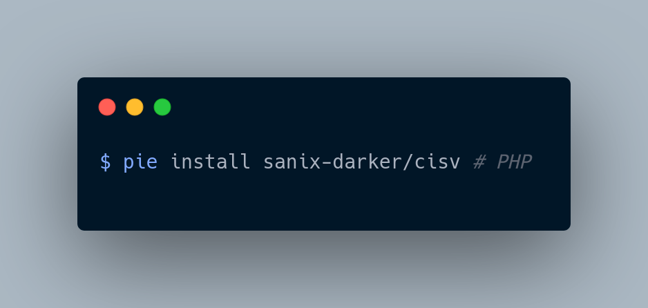
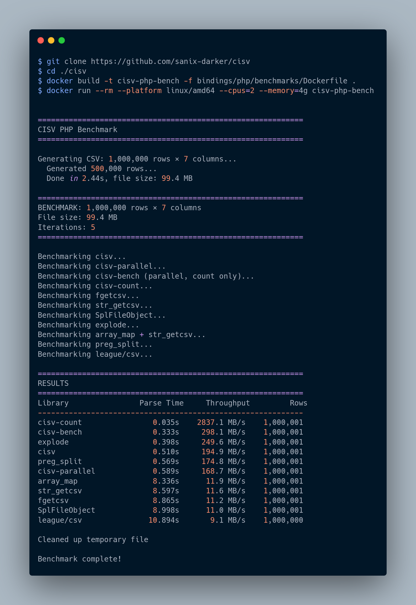

# cisv-php



[](https://github.com/Sanix-Darker/cisv-php/actions/workflows/ci.yml)

[](https://packagist.org/packages/sanix-darker/cisv)


PHP extension distribution for CISV with SIMD-accelerated CSV parsing via native C code.

## FEATURES

- Native extension parser for PHP
- Full parse API (`parseFile`, `parseString`)
- Row-by-row iterator API (`openIterator` / `fetchRow`)
- Fast row counting (`CisvParser::countRows`)
- Better memory behavior with iterator mode on very large files

## INSTALLATION

### FROM SOURCE

```bash
git clone --recurse-submodules https://github.com/Sanix-Darker/cisv-php
cd cisv-php
make -C core/core all
cd cisv
phpize
./configure --enable-cisv
make -j"$(nproc)"
sudo make install
```

Then enable extension in `php.ini`:

```ini
extension=cisv.so
```

## CORE DEPENDENCY (SUBMODULE)

This repository tracks `cisv-core` via the `./core` git submodule.

To fetch the latest `cisv-core` (main branch) in your local clone:

```bash
git submodule update --init --remote --recursive
```

CI and release workflows also run this update command, so new `cisv-core` releases are pulled automatically during builds.

## QUICK START

```php
<?php

$parser = new CisvParser(['delimiter' => ',', 'trim' => true]);
$rows = $parser->parseFile('data.csv');
print_r($rows[0]);
```

## API EXAMPLES

### PARSE FILE AND STRING

```php
<?php

$parser = new CisvParser(['trim' => true, 'skip_empty' => true]);
$fileRows = $parser->parseFile('data.csv');
$stringRows = $parser->parseString("id,name\n1,alice\n2,bob\n");
```

### FAST ROW COUNTING

```php
<?php

$total = CisvParser::countRows('large.csv');
echo "Rows: $total\n";
```

### ITERATOR MODE (RECOMMENDED FOR HUGE FILES)

```php
<?php

$parser = new CisvParser(['delimiter' => ',', 'trim' => true]);
$parser->openIterator('very_large.csv');

while (($row = $parser->fetchRow()) !== false) {
    if (!empty($row) && $row[0] === 'STOP') {
        break;
    }
    // process row
}

$parser->closeIterator();
```

## EXAMPLES DIRECTORY

Runnable examples are available in [`examples/`](./examples):

- `basic.php`
- `iterator.php`
- `sample.csv`

## VALIDATION

```bash
php -d extension=cisv/modules/cisv.so cisv/scripts/verify_api.php
```

## BENCHMARKS

```bash
docker build -t cisv-php-bench -f cisv/benchmarks/Dockerfile .
docker run --rm --platform linux/amd64 --cpus=2 --memory=4g cisv-php-bench
```



The benchmark output includes both full parse and iterator paths (including `cisv-iterator`).

## UPSTREAM CORE

- cisv-core: https://github.com/Sanix-Darker/cisv-core
